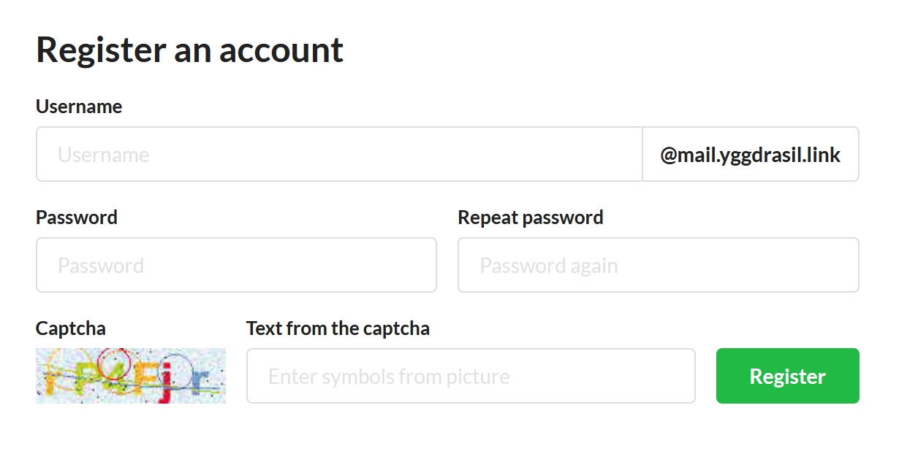

# Stalwart-reg

This project provides a simple auto-registration form to create accounts on [Stalwart mail server](https://github.com/stalwartlabs/mail-server/).



It runs as a service that is listening on some address like `0.0.0.0:80`. But it is advisable to add TLS by using Nginx or something alike.

## Building

```shell
git clone https://github.com/dis-works/stalwart-reg
cd stalwart-reg
cargo build --release
cp target/release/stalwart-reg /opt/stalwart-mail/bin/
```

## Configuration

You can generate new config by using command `/opt/stalwart-mail/stalwart-reg -g > /opt/stalwart-mail/st_reg.toml`.
Take a look into this config and adjust parameters according your situation.

## Installation

If you want for this form to work all the time you'll need the means of starting it.
Here are the instructions if you have `systemd`:

```shell
nano /etc/systemd/system/stalwart-reg.service
```

Paste this text:
```
[Unit]
Description=Stalwart registration Service
After=network.target

[Service]
ExecStart=/opt/stalwart-mail/bin/stalwart-reg -c /opt/stalwart-mail/st_reg.toml
Environment=PATH=$PATH:/opt/stalwart-mail/bin
User=root
AmbientCapabilities=CAP_NET_BIND_SERVICE
Restart=always

[Install]
WantedBy=multi-user.target
```

Then enable and start the service: `systemctl enable --now stalwart-reg`.

## Contributing

All issues, thoughts and PR's are welcome here on GitHub!